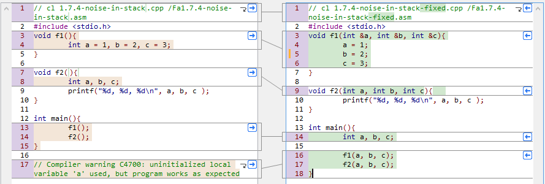

# CPP Source Code from the amazing book: [Reverse Engineering for Beginners](https://github.com/dennis714/RE-for-beginners)
- For Lazy/Beginner people like me, currently focused on x86 Microsotf Visual Studio.

## Tools
- [Visual C++ 2010 Express Edition](http://filehippo.com/es/download_visualc_2010_express_edition/tech/)
- IDA 6.8

## Why 2010 C++
Because is light and does not break my precious SQL Server 2016.
I Tried VS 2017, VS 2015. Too much and complex uninstall.
